

  <!-- Logo and Title -->
  
  <h1>Nerv Printer</h1>
  
Nerv Printer is an addon for the Meteor Client allowing you to build mapart from NBT files. It works 100% autonomously and supports both carpet, fullblock, and staircasing. Its main focus is reliability and compatibility with strict anti-cheat servers.

  <!-- Shields -->

  

## Carpet (Flat) Printer
The Carpet Printer prints the map line-by-line and does not reuse carpet items, making it only suited for servers where carpet duping is enabled.
You can find the full documentation [here](Documentation/CarpetGuide.md).

## Fullblock Printer
The Fullblock Printer builds flat & staircased fullblock maps line by line.
Printing-only mode is the default: it auto-detects combined single-NBT grids of `128x128` map tiles (including exact `2x2`, `5x5`, and larger footprints), derives the whole map area from a player-built `128x1` north cobblestone anchor occupying one canonical Minecraft map tile, builds the missing outer walkway and one-block-back access supports beyond that platform section, automatically registers nearby shulker supplies, saves and live-revalidates that setup for later maps, adds verified suspended end-rod lighting, and leaves the completed structure in place. Every two-column pair uses a complete U traversal only when its full material plan and the carried repair pickaxe fit the usable inventory; otherwise it uses separately restocked single lanes. A completed single lane returns through `/kill` and the registered bed, while a full U exits normally at the north walkway. Axe shulkers are ignored. The module widget includes **Reset Printing Config** for starting a new platform setup. The legacy `1x1` map-item handoff and teardown cycle remains available when printing-only is disabled.
This module **will not work on servers where placing blocks in the air is disabled**.
You can find the full documentation [here](Documentation/StaircasedGuide.md).

## Map Namer
Semi-automatically names unnamed map items in inventory. Pauses on anvil break and insufficient xp and can be resumed.

## Verified on Servers
- Contantiam (Folia with Grim anti-cheat)
- 6b6t
- 8b8t
- 9b9t
- EndCrystal
- MineTexas
- 2B2FR
- FBFT

## Mapart Gallery
A collection of maps printed with this addon:

  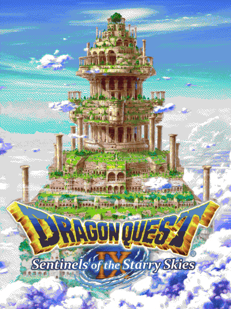
  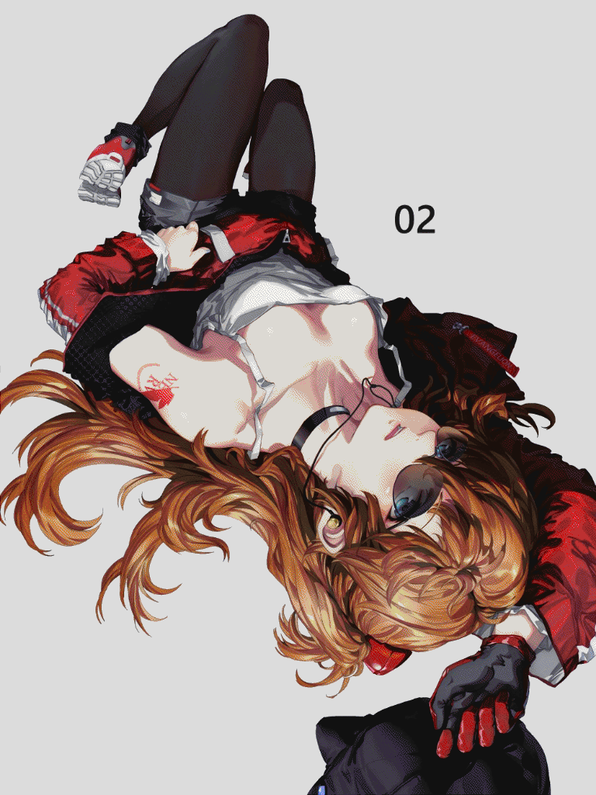
  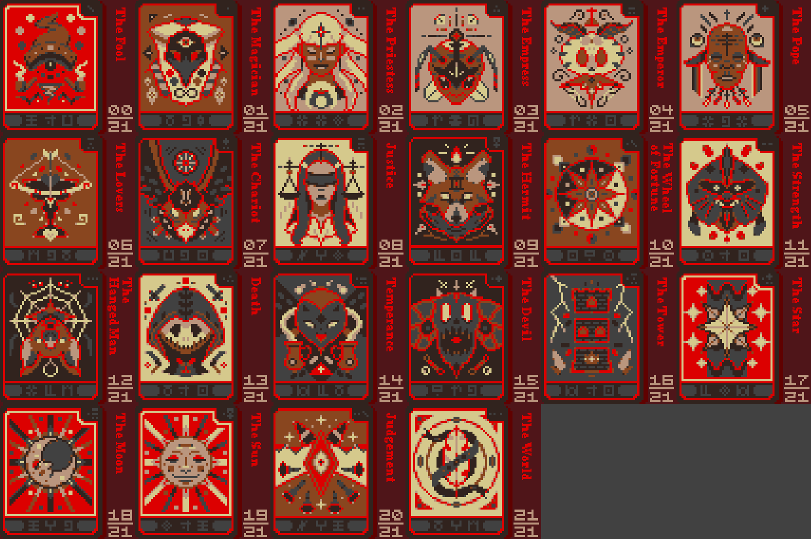
  
  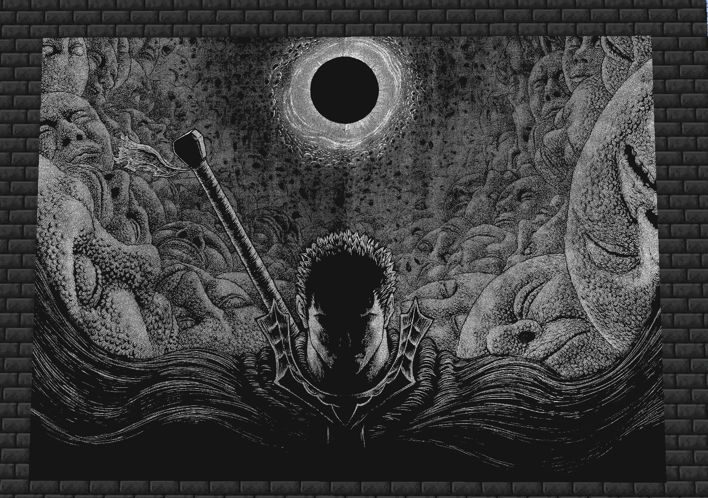
  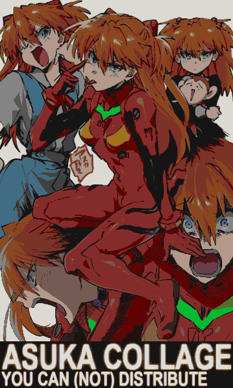
  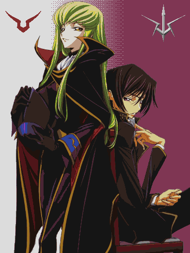
  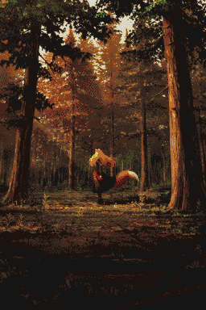
  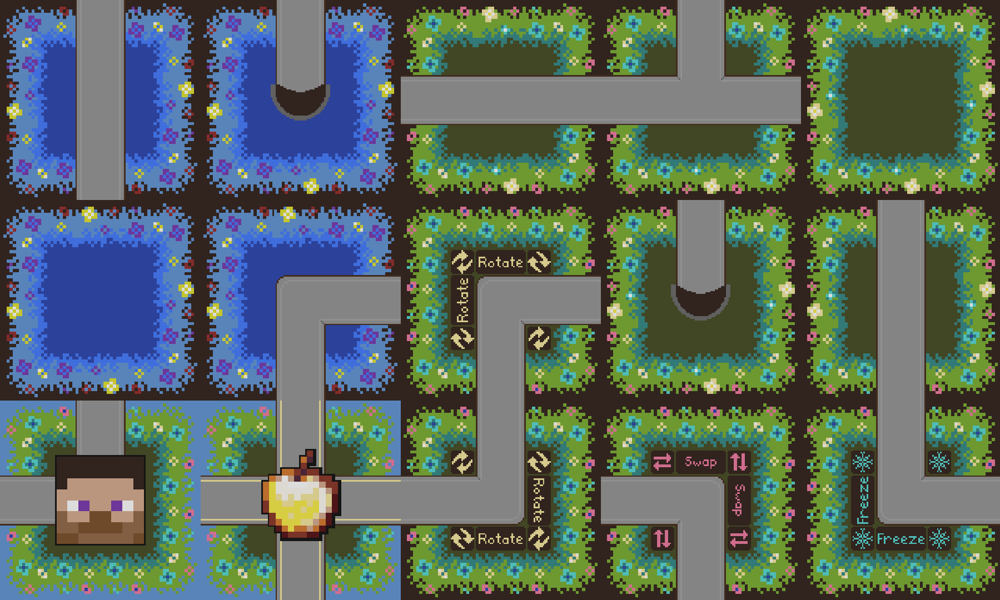
  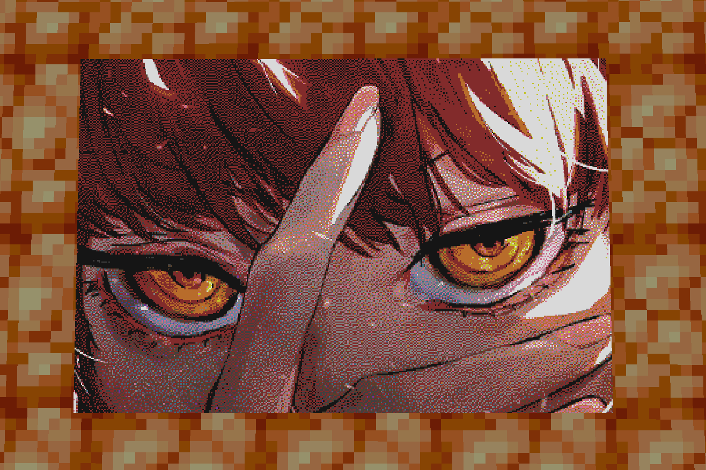
  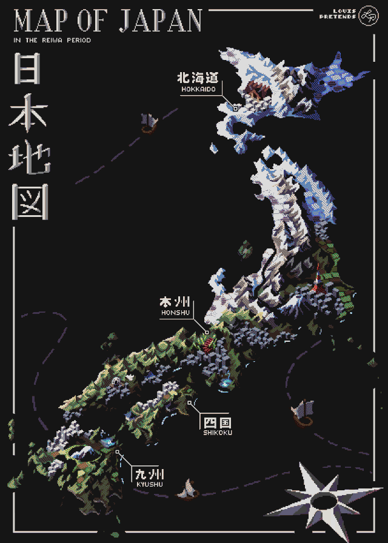
  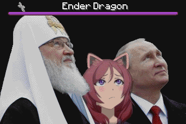
  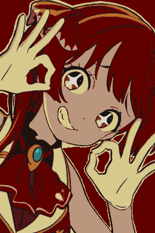
  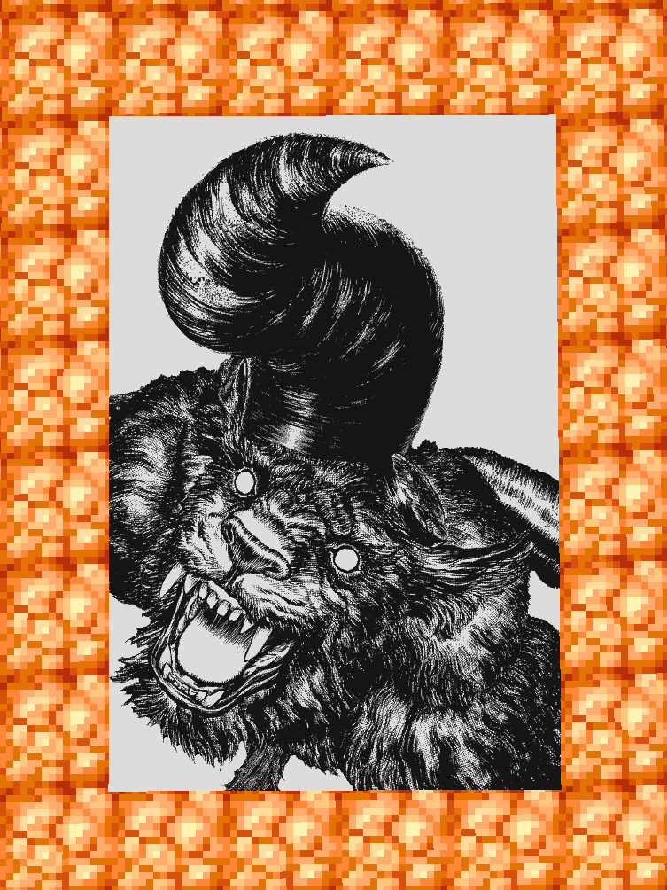
  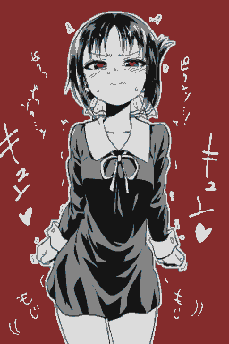
  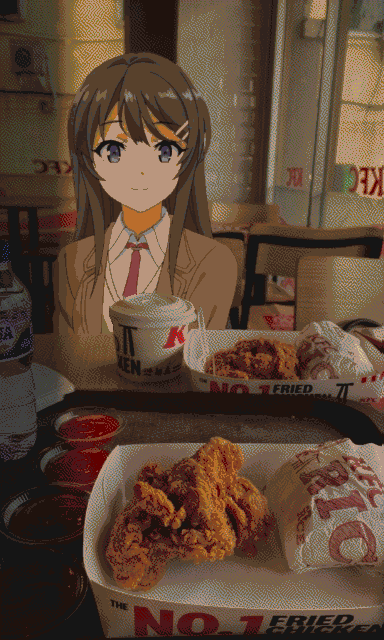
  
  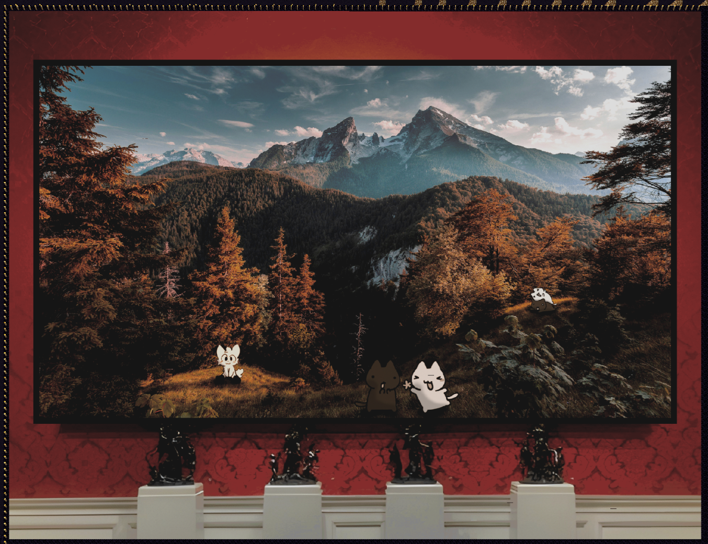

